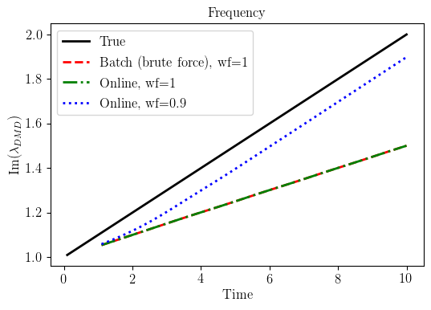
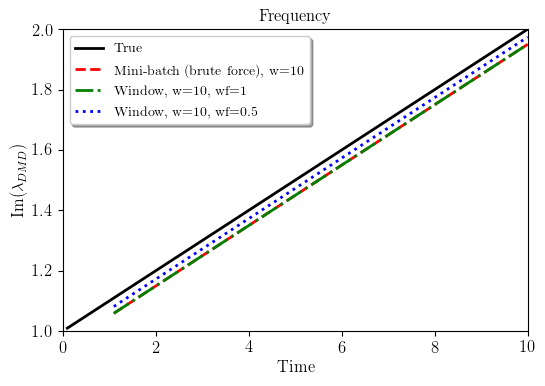

# odmd
A python package for online dynamic mode decomposition (Online DMD) and window dynamic mode decomposition (Window DMD) algorithms proposed in this [paper](https://epubs.siam.org/doi/pdf/10.1137/18M1192329). For matlab implementation, see [this repo](https://github.com/haozhg/odmd-matlab).

To get started,
```
pip install odmd --upgrade
```

A variant of this algorithm for efficient data-driven online model learning (system identification) and control is implemented in [osysid](https://github.com/haozhg/osysid) (try `pip install osysid --upgrade`). This algorithm has been show to be effective for flow separation control, see this [paper](https://doi.org/10.1017/jfm.2020.546) for more details.

## Showcase: 2D linear time-varying system
We take a 2D time-varying system given by 
- dx/dt = A(t)x

where x = [x1,x2]', A(t) = [0, w(t); -w(t), 0], w(t)=1+epsilon*t, epsilon=0.1. The slowly time-varying eigenvlaues of A(t) are pure imaginary, +(1+0.1t)j and -(1+0.1t)j, where j is the imaginary unit.

Here we show how the proposed algorithm can be used to learn a model of the system. For more detail, see [demo](https://github.com/haozhg/odmd/tree/master/demo).

### Time-varying state evolution
The system is oscillating with increasing frequency (frequency increased from 1 to 2 in 10 secs).
<p align="center">
  
</p>

### Tracking eigenvalues with online/window DMD
If we apply online/window DMD, the learned model can track the time-varying eigenvalues very well. 
- Online DMD with weighting factor makes the learned model much more adaptive and tracks the true eigenvalues closely.
- Window DMD is designed to better track time-varying dynamics, even if no weighting is used.

<p align="center">
  
   
</p>

## Hightlights
Here are some hightlights about this algorithm, and for more detail please refer to this [paper](https://epubs.siam.org/doi/pdf/10.1137/18M1192329)

- Efficient data-driven online linear/nonlinear model learning (system identification). Any nonlinear and/or time-varying system is locally linear, as long as the model is updated in real-time wrt to new measurements.
- It finds the exact optimal solution (in the sense of least square error), without any approximation (unlike stochastic gradient descent). 
- It achieves theoretical optimal time and space complexity. 
- The time complexity (flops for one iteration) is O(n^2), where n is state dimension. This is much faster than standard algorithm O(n^2 * t), where t is the current time step (number of measurements). In online applications, t >> n and essentially will go to infinity.
- The space complexity is O(n^2), which is far more efficient than standard algorithm O(n * t) (t >> n).
- A weighting factor (in (0, 1]) can be used to place more weight on recent data, thus making the model more adaptive.
- It has been successfully applied to flow separation control problem, and achived real-time closed loop control. See this [paper](https://doi.org/10.1017/jfm.2020.546) for details.

## Install
### Use pip
```
pip install odmd --upgrade
```

### Manual install
Create virtual env if needed
```
python3 -m venv .venv
source .venv/bin/activate
```

Clone from github and install
```
git clone https://github.com/haozhg/odmd.git
cd odmd/
python3 -m pip install -e .
```

### Test
To run tests
```
cd tests/
pip install r requirements.txt
python -m pytest .
```

## Algorithm Description
This is a brief introduction to the algorithm. For full technical details, see this [paper](https://epubs.siam.org/doi/pdf/10.1137/18M1192329), and chapter 3 and chapter 7 of this [PhD thesis](http://arks.princeton.edu/ark:/88435/dsp0108612r49q).

### Unknown dynamical system
Suppose we have a (discrete) nonlinear and/or time-varying [dynamical system](https://en.wikipedia.org/wiki/State-space_representation), and the state space representation is
- z(t) = f(t, z(t-1))

where t is (discrete) time, z(t) is state vector.

In general, a variant of this algorithm (try `pip install osysid`, see [here](https://github.com/haozhg/osysid)) also works if we have a nonlinear and/or time-varying map
- y(t) = f(t, x(t))

where x(t) is the input and y(t) is the output. Notice that dynamical system is a special case of nonlinear maps, by taking y(t) = z(t) and x(t) = z(t-1).

- It is assumed that we have measurements z(t) for t = 0,1,...T. 
- However, we do not know function f. 
- We aim to learn a linear model for the unknown dynamical system from measurement data up to time T.
- We want to the model to be updated efficiently in real-time as new measurement data becomes available.

From now on, we will denote y(t) = z(t) and x(t) = z(t-1), so that the dynamical system can be written in this form
- y(t) = f(t, x(t))

### Online DMD algorithm description
The algorithm is implemented in class [OnlineDMD](./odmd/online.py).

At time step t, define two matrix 
- X(t) = [x(1),x(2),...,x(t)],
- Y(t) = [y(1),y(2),...,y(t)], 

that contain all the past snapshot pairs, where x(t), y(t) are the n dimensional state vector, y(t) = f(t, x(t)) is the image of x(t), f() is the dynamics.  Here, if the (discrete-time) dynamics are given by z(t) = f(t, z(t-1)), then x(t), y(t) should be measurements corresponding to consecutive states z(t-1) and z(t).  

We would like to learn an adaptive online linear model M (a matrix) st 
- y(t) = M * x(t)

The matrix M is updated in real-time when new measurement becomes available. We aim to find the best M that leads to least-squre errors.

An exponential weighting factor rho=sigma^2 (0<rho<=1) that places more weight on recent data can be incorporated into the definition of X(t) and Y(t) such that 
- X(t) = [sigma^(t-1)*x(1),sigma^(t-2)*x(2),…,sigma^(1)*x(t-1),x(t)], 
- Y(t) = [sigma^(t-1)*y(1),sigma^(t-2)*y(2),...,sigma^(1)*y(t-1),y(t)].  

At time t+1, the matrices become 
- X(t+1) = [x(1),x(2),…,x(t),x(t+1)], 
- Y(t+1) = [y(1),y(2),…,y(t),y(t+1)]. 

We need to incorporate a new snapshot pair x(t+1), y(t+1) into the least-square objective function. We can update the DMD matrix A(t) online by efficient rank-1 updating online DMD algorithm.  

- The time complexity (multiply–add operation for one iteration) is O(n^2), 
- and space complexity is O(n^2), where n is the state dimension.  

### Window DMD algorithm description
The algorithm is implemented in class [WindowDMD](./odmd/window.py).

At time step t, define two matrix 
- X(t) = [x(t-w+1),x(t-w+2),...,x(t)], 
- Y(t) = [y(t-w+1),y(t-w+2),...,y(t)] 

that contain the recent w snapshot pairs from a finite time window, where x(t), y(t) are the n dimensional state vector, y(t) = f(t, x(t)) is the image of x(t), f() is the dynamics. Here, if the (discrete-time) dynamics are given by z(t) = f(t, z(t-1)), then x(t), y(t) should be measurements corresponding to consecutive states z(t-1) and z(t).

Similarly, we formulate this as a least-square optimization problem.

An exponential weighting factor rho=sigma^2 (0<rho<=1) that places more weight on recent data can be incorporated into the definition of X(t) and Y(t) such that 
- X(t) = [sigma^(w-1)*x(t-w+1),sigma^(w-2)*x(t-w+2),…,sigma^(1)*x(t-1),x(t)], 
- Y(t) = [sigma^(w-1)*y(t-w+1),sigma^(w-2)*y(t-w+2),…,sigma^(1)*y(t-1),y(t)].

At time t+1, the data matrices become 
- X(t+1) = [x(t-w+2),x(t-w+3),…,x(t+1)], 
- Y(t+1) = [y(t-w+2),y(t-w+3),…,y(t+1)]. 

The models needs to forget the oldest snapshot pair x(t-w+1),y(t-w+1), and remember the newest snapshot pair x(t+1),y(t+1). We can update the DMD matrix A(t) online by efficient rank-2 updating window DMD algroithm.  

- The time complexity (multiply–add operation for one iteration) is O(n^2), 
- and space complexity is O(wn+2n^2), where n is the state dimension, and w is the window size. Typically w is taken to be O(n), e.g, w = 2n, or 10n.

## Demo
See [demo](./demo) for python notebooks.
- `demo_online.ipynb` shows how to use online DMD to learn adaptive online model for 2D time varying system.
- `demo_window.ipynb` shows how to use online DMD to learn adaptive online model for 2D time varying system.

## Authors:
Hao Zhang 

## Reference
If you you used these algorithms or this python package in your work, please consider citing

```
Zhang, Hao, Clarence W. Rowley, Eric A. Deem, and Louis N. Cattafesta. 
"Online dynamic mode decomposition for time-varying systems." 
SIAM Journal on Applied Dynamical Systems 18, no. 3 (2019): 1586-1609.
```

BibTeX
```
@article{zhang2019online,
  title={Online dynamic mode decomposition for time-varying systems},
  author={Zhang, Hao and Rowley, Clarence W and Deem, Eric A and Cattafesta, Louis N},
  journal={SIAM Journal on Applied Dynamical Systems},
  volume={18},
  number={3},
  pages={1586--1609},
  year={2019},
  publisher={SIAM}
}
```

## Date created
April 2017

## License
MIT

If you want to use this package, but find license permission an issue, pls contact me at `haozhang at alumni dot princeton dot edu`.

## Issues
If there is any comment/suggestion, or if you find any bug, feel free to 
- create an issue [here](https://github.com/haozhg/osysid/issues), or
- fork this repo, make changes, and create a pull request (merge from your fork to this repo)